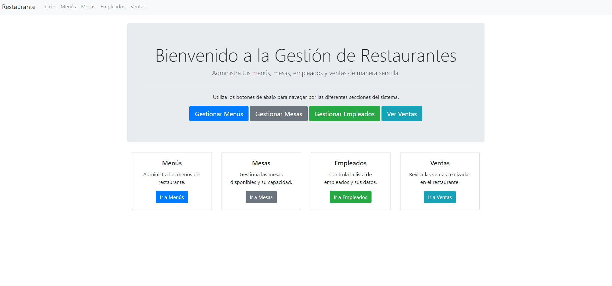

# Gestión de Restaurantes

## Descripción

RestauranteGestor es una aplicación diseñada para gestionar de manera eficiente reservas, pedidos, menús, empleados y facturación en restaurantes.

## Características

- Gestión de reservas y pedidos en línea.
- Administración de menús y precios en tiempo real.
- Generación y gestión de facturas.
- Informes detallados sobre ventas y desempeño.
- Gestión de empleados y horarios.

## Tecnologías Utilizadas

- **Backend:** Django (Python)
- **Frontend:** JavaScript, HTML, CSS
- **Base de Datos:** SQLite (incluido por defecto con Django)

## Requisitos

- Python 3.x
- Django
- SQLite (incluido por defecto con Django)
- Pip
- Virtualenv

